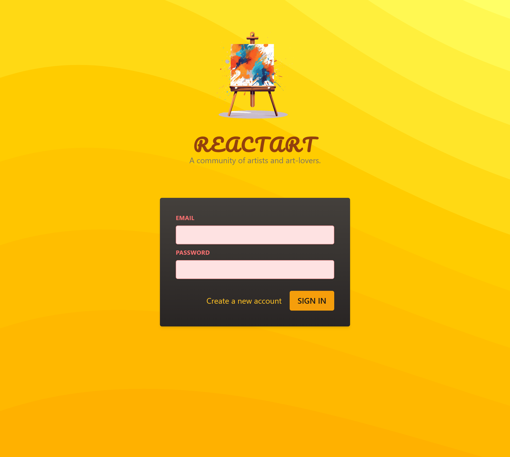

# Auth-page

<h2>Overview</h2>

ReactArt is a login page designed for a community of artists and art lovers. The UI features a vibrant artistic theme with a modern login form, making it visually appealing and user-friendly.

<h2>Features</h2>
<ul>
    <li><strong>Beautiful UI</strong>: A warm, artistic design with a creative background.</li>
    <li><strong>Login Form</strong>: Simple and intuitive login form with email and password fields.</li>
    <li><strong>Responsive Design</strong>: Ensures compatibility with various screen sizes.</li>
    <li><strong>Sign Up Option</strong>: Link to create a new account.</li>
</ul>

<h2>Technologies Used</h2>
<ul>
    <li><strong>React.js</strong> - Frontend framework</li>
    <li><strong>Tailwind CSS</strong> - Styling framework</li>
    <li><strong>Shadcn/UI</strong> - UI components library (if applicable)</li>
</ul>

<h2>Installation</h2>
<ol>
    <li>Clone the repository:
        <pre><code>git clone https://github.com/yourusername/Auth-page.git</code></pre>
    </li>
    <li>Navigate to the project directory:
        <pre><code>cd Auth-page</code></pre>
    </li>
    <li>Install dependencies:
        <pre><code>npm install</code></pre>
    </li>
    <li>Start the development server:
        <pre><code>npm start</code></pre>
    </li>
</ol>

<h2>Usage</h2>
<ul>
    <li>Enter your email and password to sign in.</li>
    <li>Click "Create a new account" to register.</li>
</ul>

<h2>Contribution</h2>

Feel free to contribute to this project by submitting a pull request or opening an issue.

<h2>License</h2>

This project is licensed under the MIT License.

<h2>Screenshot</h2>

